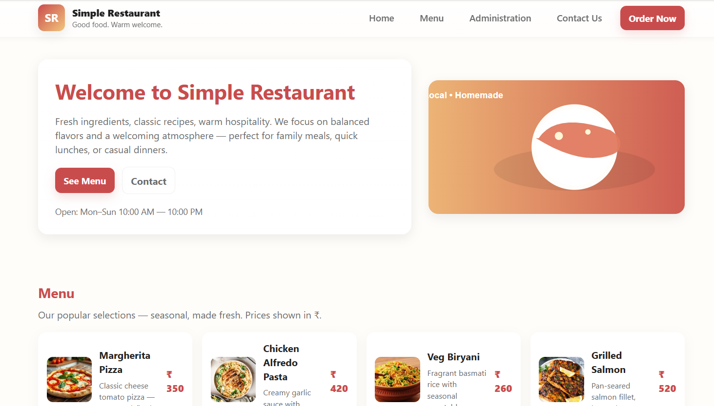

# Ex.07 Restaurant Website
## Date:08/10/2025

## AIM:
To develop a static Restaurant website to display the food items and services provided by them.

## DESIGN STEPS:

### Step 1:
Requirement collection.

### Step 2:
Creating the layout using HTML and CSS.

### Step 3:
Updating the sample content.

### Step 4:
Choose the appropriate style and color scheme.

### Step 5:
Validate the layout in various browsers.

### Step 6:
Validate the HTML code.

### Step 7:
Publish the website in the given URL.

## PROGRAM:
```
<!doctype html>
<html lang="en">
<head>
  <meta charset="utf-8" />
  <meta name="viewport" content="width=device-width,initial-scale=1" />
  <title>Simple Restaurant — Home</title>
  <style>
    /* =====================
       COLOR SCHEME VARIABLES
       (change here to change the site)
       ===================== */
    :root{
      --primary: #C94C4C;      /* Warm terracotta (accent & buttons) */
      --primary-600: #A73B3B;
      --accent: #F2C57C;       /* warm gold */
      --bg: #fffdfa;           /* very light cream */
      --muted: #6b6b6b;        /* muted text */
      --card-bg: #fff;         /* cards */
      --glass: rgba(255,255,255,0.7);
      --radius: 12px;
      --max-width: 1100px;
      --shadow: 0 6px 18px rgba(10,10,10,0.08);
      --nav-height: 64px;
      --font-sans: "Segoe UI", Roboto, "Helvetica Neue", Arial, sans-serif;
    }

    /* =====================
       BASIC RESET + LAYOUT
       ===================== */
    *{box-sizing:border-box}
    html,body{height:100%}
    body{
      margin:0;
      font-family:var(--font-sans);
      background:var(--bg);
      color:#222;
      -webkit-font-smoothing:antialiased;
      -moz-osx-font-smoothing:grayscale;
      line-height:1.45;
    }
    a{color:inherit; text-decoration:none}

    .container{
      max-width:var(--max-width);
      margin:0 auto;
      padding:28px;
    }

    /* =====================
       NAVIGATION
       ===================== */
    header{
      position:sticky;
      top:0;
      z-index:40;
      backdrop-filter: blur(6px);
      background: linear-gradient(180deg, rgba(255,255,255,0.8), rgba(255,255,255,0.6));
      border-bottom:1px solid rgba(0,0,0,0.04);
      box-shadow: 0 2px 8px rgba(0,0,0,0.03);
    }
    .nav{
      height:var(--nav-height);
      display:flex;
      align-items:center;
      gap:24px;
      justify-content:space-between;
      max-width:var(--max-width);
      margin:0 auto;
      padding:0 20px;
    }
    .brand{display:flex;align-items:center;gap:12px}
    .logo{
      width:44px;height:44px;border-radius:10px;
      display:grid;place-items:center;
      background:linear-gradient(135deg,var(--primary),var(--accent));
      color:white;font-weight:700;
      box-shadow:var(--shadow);
      font-size:18px;
    }
    nav ul{list-style:none;margin:0;padding:0;display:flex;gap:18px;align-items:center}
    nav li a{
      padding:8px 12px;border-radius:8px;color:var(--muted);
      font-weight:600;font-size:15px;
    }
    nav li a:hover{background:transparent;color:var(--primary);}

    /* CTA button in nav */
    .btn{
      background:var(--primary); color:white; padding:10px 14px;border-radius:10px;
      box-shadow:0 6px 16px rgba(201,76,76,0.18); font-weight:700;
    }
    .btn:active{transform:translateY(1px)}

    /* =====================
       HERO / HOME (sample-like)
       ===================== */
    .hero{
      display:grid;
      grid-template-columns:1fr 420px;
      gap:28px;
      align-items:center;
      padding:36px 20px;
    }
    .hero-card{
      background: linear-gradient(180deg, rgba(255,255,255,0.9), rgba(255,255,255,0.95));
      padding:28px;border-radius:16px;box-shadow:var(--shadow);
    }
    .hero h1{margin:0 0 12px;font-size:34px;color:var(--primary);}
    .hero p{margin:0 0 18px;color:var(--muted); max-width:62ch}
    .hero .cta-row{display:flex;gap:12px;align-items:center}
    .hero .cta-row .btn{font-size:15px}

    /* Banner image area (right) */
    .banner{
      position:relative;height:220px;border-radius:16px;overflow:hidden;
      box-shadow:var(--shadow);
      display:flex;align-items:center;justify-content:center;
      background:
        radial-gradient(circle at 20% 20%, rgba(255,255,255,0.35), transparent 20%),
        linear-gradient(135deg, rgba(201,76,76,0.12), rgba(242,197,124,0.06));
    }
    .banner svg{width:100%; height:100%; object-fit:cover; display:block}

    /* =====================
       MENU section
       ===================== */
    .section{
      padding:44px 20px;
    }
    .section h2{margin:0 0 8px;font-size:22px;color:var(--primary)}
    .menu-grid{
      margin-top:18px;
      display:grid;
      grid-template-columns: repeat(auto-fit, minmax(220px, 1fr));
      gap:16px;
    }
    .menu-item{
      background:var(--card-bg);
      border-radius:14px;padding:14px;display:flex;gap:12px;align-items:center;
      box-shadow: 0 6px 20px rgba(20,20,20,0.04);
    }
    .food-img img {
        width: 74px;
        height: 74px;
        object-fit: cover;
        border-radius: 10px;
    }
    .food-img svg{width:60px;height:60px}
    .food-info h4{margin:0 0 6px;font-size:16px}
    .food-info p{margin:0;color:var(--muted);font-size:13px}
    .price{margin-left:auto;font-weight:800;color:var(--primary)}

    /* =====================
       ADMINISTRATION
       ===================== */
    .admin-grid{
      margin-top:18px;display:grid;grid-template-columns:repeat(auto-fit,minmax(190px,1fr));gap:16px;
    }
    .admin-card{
      background:var(--card-bg);padding:14px;border-radius:12px;display:flex;gap:12px;align-items:center;
      box-shadow:var(--shadow)
    }
    .avatar{
      width:64px;height:64px;border-radius:12px;display:grid;place-items:center;background:linear-gradient(135deg,var(--accent),var(--primary));
      color:white;font-weight:700;
      flex:0 0 64px;
    }
    .admin-meta h4{margin:0 0 6px;font-size:15px}
    .admin-meta p{margin:0;color:var(--muted);font-size:13px}

    /* =====================
       CONTACT
       ===================== */
    .contact-card{
      padding:18px;border-radius:12px;background:linear-gradient(180deg,var(--glass),transparent);box-shadow:var(--shadow);
      display:grid;gap:8px;max-width:720px;
    }
    .contact-row{display:flex;gap:10px;align-items:center}

    /* =====================
       FOOTER
       ===================== */
    footer{
      margin-top:36px;padding:24px 20px;border-top:1px solid rgba(0,0,0,0.04);
      background:linear-gradient(180deg, rgba(0,0,0,0.01), transparent)
    }
    .footer-inner{max-width:var(--max-width);margin:0 auto;display:flex;justify-content:space-between;align-items:center;gap:12px}
    .small{font-size:13px;color:var(--muted)}

    /* =====================
       RESPONSIVE
       ===================== */
    @media (max-width:920px){
      .hero{grid-template-columns:1fr}
      nav ul{display:none}
      .nav{padding:0 12px}
    }
  </style>
</head>
<body>

<header>
  <div class="nav" role="navigation" aria-label="Main">
    <div class="brand">
      <div class="logo" aria-hidden="true">SR</div>
      <div>
        <div style="font-weight:800">Simple Restaurant</div>
        <div style="font-size:12px;color:var(--muted)">Good food. Warm welcome.</div>
      </div>
    </div>

    <nav aria-label="Primary">
      <ul>
        <li><a href="#home">Home</a></li>
        <li><a href="#menu">Menu</a></li>
        <li><a href="#admin">Administration</a></li>
        <li><a href="#contact">Contact Us</a></li>
        <li><a class="btn" href="#menu">Order Now</a></li>
      </ul>
    </nav>
  </div>
</header>

<main>
  <section id="home" class="hero container" aria-labelledby="home-title">
    <div class="hero-card">
      <h1 id="home-title">Welcome to Simple Restaurant</h1>
      <p>Fresh ingredients, classic recipes, warm hospitality. We focus on balanced flavors and a welcoming atmosphere — perfect for family meals, quick lunches, or casual dinners.</p>

      <div class="cta-row">
        <a class="btn" href="#menu">See Menu</a>
        <a href="#contact" style="padding:10px 14px;border-radius:10px;background:transparent;border:1px solid rgba(0,0,0,0.06);font-weight:700;color:var(--muted)">Contact</a>
      </div>

      <div style="margin-top:18px;color:var(--muted);font-size:14px;">
        Open: Mon–Sun 10:00 AM — 10:00 PM
      </div>
    </div>

    <div class="banner" aria-hidden="true">
      <!-- Banner image (SVG) - you can replace this part with an external image if desired -->
      <svg viewBox="0 0 800 300" preserveAspectRatio="xMidYMid slice" xmlns="http://www.w3.org/2000/svg" role="img" aria-label="Banner image">
        <defs>
          <linearGradient id="g1" x1="0" x2="1">
            <stop offset="0" stop-color="#F2C57C"/>
            <stop offset="1" stop-color="#C94C4C"/>
          </linearGradient>
        </defs>
        <rect width="100%" height="100%" fill="url(#g1)"/>
        <!-- Plate -->
        <g transform="translate(120,30)">
          <ellipse cx="320" cy="170" rx="180" ry="48" fill="rgba(0,0,0,0.08)"/>
          <circle cx="320" cy="120" r="96" fill="#fffdfa"/>
          <circle cx="320" cy="120" r="86" fill="#fff"/>
          <!-- food stylized -->
          <path d="M240 100 q40 -60 160 -18 q30 18 20 42 q-4 8 -14 12 q-70 28 -172 -36z" fill="#E07A5F" opacity="0.95"/>
          <circle cx="285" cy="95" r="9" fill="#fff6d6"/>
          <circle cx="350" cy="86" r="6" fill="#fff6d6"/>
        </g>

        <text x="30" y="40" font-family="sans-serif" font-weight="700" font-size="20" fill="#fff">Fresh • Local • Homemade</text>
      </svg>
    </div>
  </section>

  <!-- MENU -->
  <section id="menu" class="section container" aria-labelledby="menu-title">
    <h2 id="menu-title">Menu</h2>
    <p style="color:var(--muted);margin-top:6px;">Our popular selections — seasonal, made fresh. Prices shown in ₹.</p>

    <div class="menu-grid" aria-live="polite">
      <!-- 12 food items -->
      <article class="menu-item">
        <div class="food-img">
            
        </div>
        <div class="food-info">
          <h4>Margherita Pizza</h4>
          <p>Classic cheese tomato pizza — 10" wood-fired.</p>
        </div>
        <div class="price">₹ 350</div>
      </article>

      <article class="menu-item">
        <div class="food-img">
            
        </div>
        <div class="food-info"><h4>Chicken Alfredo Pasta</h4><p>Creamy garlic sauce with grilled chicken.</p></div>
        <div class="price">₹ 420</div>
      </article>

      <article class="menu-item">
        <div class="food-img">
            
        </div>
        <div class="food-info"><h4>Veg Biryani</h4><p>Fragrant basmati rice with seasonal vegetables.</p></div>
        <div class="price">₹ 260</div>
      </article>

      <article class="menu-item">
        <div class="food-img">
            
        </div>
        <div class="food-info"><h4>Grilled Salmon</h4><p>Pan-seared salmon fillet, lemon butter.</p></div>
        <div class="price">₹ 520</div>
      </article>

      <article class="menu-item">
        <div class="food-img">
            
        </div>
        <div class="food-info"><h4>Cheeseburger</h4><p>100% beef patty, cheddar, house sauce.</p></div>
        <div class="price">₹ 300</div>
      </article>

      <article class="menu-item">
        <div class="food-img">
            
        </div>
        <div class="food-info"><h4>Paneer Tikka</h4><p>Charred paneer cubes with spices.</p></div>
        <div class="price">₹ 280</div>
      </article>

      <article class="menu-item">
        <div class="food-img">
            
        </div>
        <div class="food-info"><h4>Caesar Salad</h4><p>Crisp romaine, parmesan, creamy dressing.</p></div>
        <div class="price">₹ 220</div>
      </article>

      <article class="menu-item">
        <div class="food-img">
            
        </div>
        <div class="food-info"><h4>Butter Chicken</h4><p>Rich tomato gravy, soft tandoori chicken.</p></div>
        <div class="price">₹ 380</div>
      </article>

      <article class="menu-item">
        <div class="food-img">
            
        </div>
        <div class="food-info"><h4>Tom Yum Soup</h4><p>Hot & sour Thai soup with prawns.</p></div>
        <div class="price">₹ 240</div>
      </article>

      <article class="menu-item">
        <div class="food-img">
            
        </div>
        <div class="food-info"><h4>Chocolate Lava Cake</h4><p>Warm, gooey center; served with cream.</p></div>
        <div class="price">₹ 160</div>
      </article>

      <article class="menu-item">
        <div class="food-img">
            
        </div>
        <div class="food-info"><h4>Fish & Chips</h4><p>Crispy battered fish with fries.</p></div>
        <div class="price">₹ 380</div>
      </article>

      <article class="menu-item">
        <div class="food-img">
            
        </div>
        <div class="food-info"><h4>Masala Dosa</h4><p>Crispy dosa with spiced potato filling.</p></div>
        <div class="price">₹ 140</div>
      </article>

    </div>
  </section>

  <!-- ADMINISTRATION -->
  <section id="admin" class="section container" aria-labelledby="admin-title">
    <h2 id="admin-title">Administration</h2>
    <p style="color:var(--muted);margin-top:6px;">The team behind the kitchen and operations.</p>

    <div class="admin-grid" role="list">
      <div class="admin-card" role="listitem">
        <div class="avatar" aria-hidden="true">AS</div>
        <div class="admin-meta">
          <h4>Asha Singh</h4>
          <p>Head Chef</p>
        </div>
      </div>

      <div class="admin-card">
        <div class="avatar">RK</div>
        <div class="admin-meta">
          <h4>Ravi Kumar</h4>
          <p>Restaurant Manager</p>
        </div>
      </div>

      <div class="admin-card">
        <div class="avatar">LP</div>
        <div class="admin-meta">
          <h4>Leena Patel</h4>
          <p>Head of Service</p>
        </div>
      </div>

      <div class="admin-card">
        <div class="avatar">SM</div>
        <div class="admin-meta">
          <h4>Sahil Mehra</h4>
          <p>Kitchen Supervisor</p>
        </div>
      </div>

      <div class="admin-card">
        <div class="avatar">PN</div>
        <div class="admin-meta">
          <h4>Priya Nair</h4>
          <p>Marketing & Events</p>
        </div>
      </div>

      <div class="admin-card">
        <div class="avatar">DK</div>
        <div class="admin-meta">
          <h4>Deepak Kapoor</h4>
          <p>Accounts & Admin</p>
        </div>
      </div>
    </div>
  </section>

  <!-- CONTACT US -->
  <section id="contact" class="section container" aria-labelledby="contact-title">
    <h2 id="contact-title">Contact Us</h2>
    <p style="color:var(--muted);margin-top:6px;">Get in touch — reservations, events, or general queries.</p>

    <div style="margin-top:14px;display:grid;gap:14px;grid-template-columns:1fr 320px;">
      <div class="contact-card" aria-label="Contact details">
        <div class="contact-row" style="gap:14px">
          <div style="font-weight:700">Address</div>
          <div style="color:var(--muted);">No. 12, Orchard Lane, MG Road, Bangalore — 560001, India</div>
        </div>

        <div class="contact-row">
          <div style="font-weight:700">Phone</div>
          <div style="color:var(--muted);">+91 98765 43210</div>
        </div>

        <div class="contact-row">
          <div style="font-weight:700">Email</div>
          <div style="color:var(--muted);">info@simplerestaurant.example</div>
        </div>

        <div style="margin-top:8px;color:var(--muted)">You can also reach us via the "Order Now" button at the top to place a takeaway order.</div>
      </div>

      <div style="border-radius:12px;padding:18px;background:var(--card-bg);box-shadow:var(--shadow)">
        <div style="font-weight:700;margin-bottom:8px">Opening Hours</div>
        <div style="color:var(--muted)">Mon — Sun: 10:00 AM — 10:00 PM</div>

        <hr style="margin:12px 0;border:none;border-top:1px solid rgba(0,0,0,0.05)">

        <div style="font-weight:700;margin-bottom:8px">Quick Contact</div>
        <form onsubmit="event.preventDefault(); alert('Thank you! (form not connected)')">
          <div style="display:grid;gap:8px">
            <input name="name" placeholder="Your name" required style="padding:10px;border-radius:8px;border:1px solid rgba(0,0,0,0.06)">
            <input type="email" name="email" placeholder="Email" required style="padding:10px;border-radius:8px;border:1px solid rgba(0,0,0,0.06)">
            <textarea name="msg" placeholder="Message" rows="3" style="padding:10px;border-radius:8px;border:1px solid rgba(0,0,0,0.06)"></textarea>
            <button class="btn" type="submit">Send</button>
          </div>
        </form>
      </div>
    </div>
  </section>
</main>

<footer>
  <div class="footer-inner">
    <div class="small">© <strong>Simple Restaurant</strong> — All rights reserved.</div>
    <div class="small">Designed by Kishoor</div>
  </div>
</footer>

</body>
</html>
```

## OUTPUT:


## RESULT:
The program for designing software company website using HTML and CSS is completed successfully.
